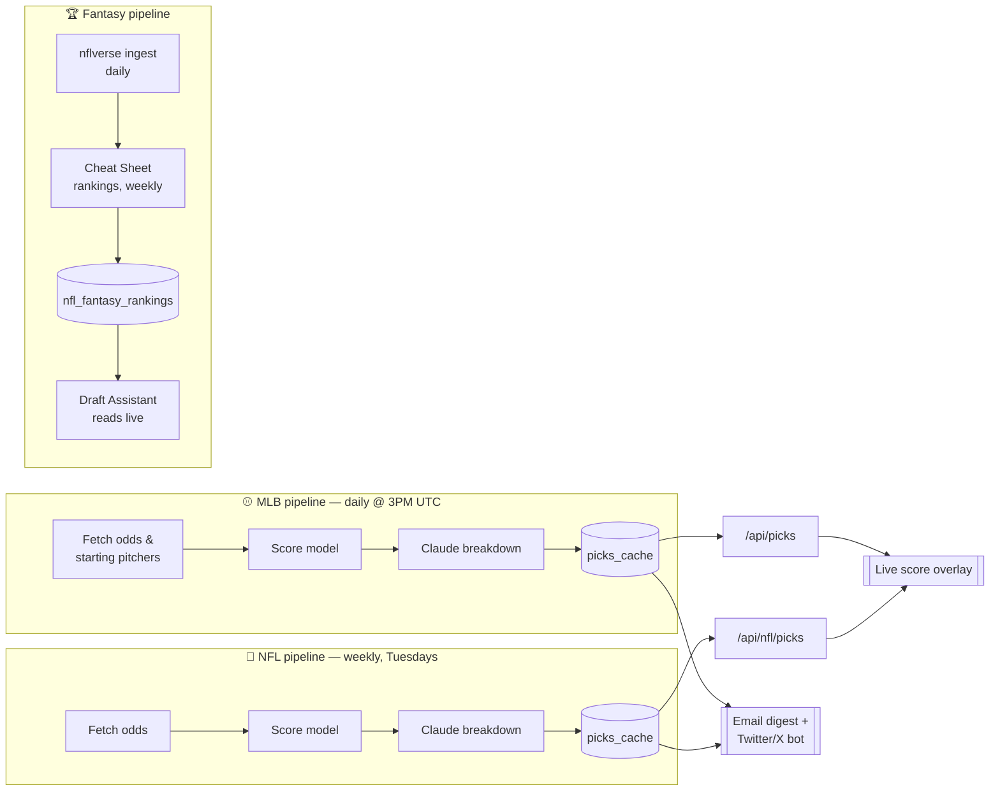
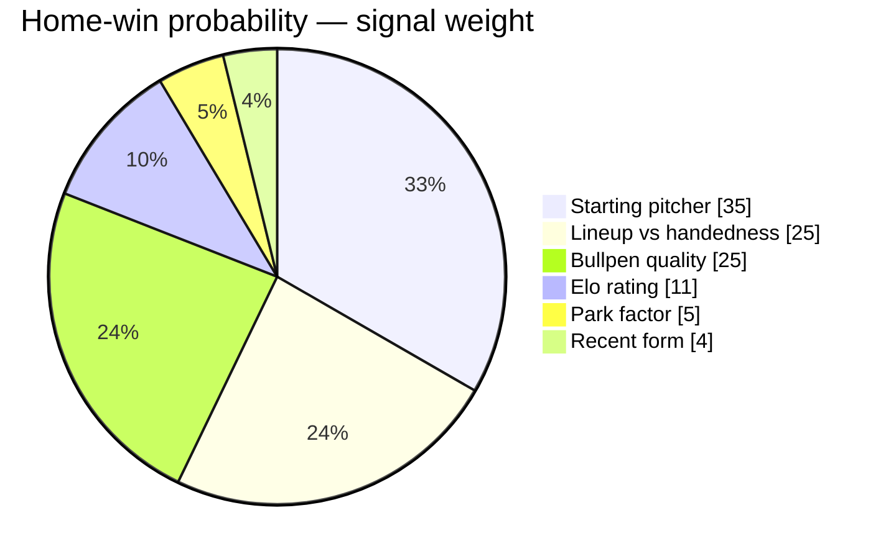

<div align="center">


# This Or That&nbsp;(T\|T)

**AI-powered MLB & NFL betting picks, wrapped around a full NFL fantasy football suite** —
a statistical prediction model, Claude-generated analysis, a live draft assistant, an in-app
AI chat assistant, Stripe subscriptions, and fully automated daily operations.

[](https://thisthatpicks.com/)
[](https://github.com/mmarshall6402-oss/tot-app/commits/main)
[](https://github.com/mmarshall6402-oss/tot-app)
[](https://twitter.com/ThisorThatPicks)

<br/>


</div>

> Looking for the exhaustive feature-by-feature breakdown (every route, cron job, and admin tool)?
> See [`FEATURES.md`](./FEATURES.md). For marketing/content material built on top of that
> inventory, see [`marketing/`](./marketing/).

### Contents

[Features](#features) · [Tech Stack](#tech-stack) · [Architecture](#architecture) ·
[Prediction Model](#prediction-model) · [Project Structure](#project-structure) ·
[Local Development](#local-development) · [Deployment](#deployment)

---

## Features

**MLB & NFL betting**
- **Daily/weekly picks** — statistical model generates MLB picks each morning and NFL picks each
  week, with confidence scores and edge ratings
- **Verdict system** — every pick is scored `CLEAN` / `BET` / `PASS` / `TRAP`, with a `HALF SIZE`
  flag for elevated bullpen risk (see [Verdict system](#verdict-system) below)
- **AI breakdowns** — Claude writes a narrative analysis for each pick covering matchup context,
  pitching, and bullpen
- **Player props** — prop picks generated and cached alongside moneyline picks (MLB and NFL)
- **"Steals"** — a curated feed of the single highest-edge picks across the board
- **Depth charts** — NFL team depth charts with injury-status overlays
- **Record tracking** — public W-L record with a monthly calendar view and model performance
  analytics, for both MLB and NFL

**NFL fantasy football**
- **Cheat Sheet / rankings** — weekly-computed rankings by scoring format (PPR / half-PPR /
  standard), with VORP, gap-detected tiers, ADP value-delta badges, and expected-vs-actual
  regression flags
- **Situational adjustments** — pace-of-play, play-caller tendency, offensive personnel usage, and
  schedule adjustments layered onto base projections
- **Draft Assistant** — a live, on-the-clock tool that recommends picks based on your roster needs
  and who's already off the board, with snake-draft turn tracking and Sleeper league sync
- **Backtested projections** — validated against realized historical seasons independently of the
  MLB backtest system

**AI & retention**
- **In-app AI chat** — a Claude-powered assistant scoped to today's board (highlights top edges,
  suggests parlay combos)
- **AI game recaps** — auto-generated post-game boxscore summaries
- **Bet Tracker / Portfolio** — users save their own picks and track personal P&L

**Growth & monetization**
- **Stripe paywall** — full subscription flow (monthly + season pricing) with checkout, webhooks,
  and self-serve billing portal
- **Access codes** — invite friends and family with code-based free access
- **Twitter/X bot** — top picks posted automatically each day ([@ThisorThatPicks](https://twitter.com/ThisorThatPicks))
- **Email delivery** — daily pick digest and weekly summary sent via Resend
- **Admin panel** — manage picks, tune model weights, run backtests, import fantasy data, post
  tweets manually, manage access codes, and monitor model accuracy and API quota usage

See [`FEATURES.md`](./FEATURES.md) for the full inventory, including every automated cron job.

---

## Tech Stack

<div align="center">

-000000?style=flat-square&logo=next.js&logoColor=white)


-000000?style=flat-square&logo=vercel&logoColor=white)


</div>

| Layer | Technology |
|---|---|
| Framework | Next.js (App Router), React 19 |
| Database & Auth | Supabase |
| Payments | Stripe |
| AI | Anthropic Claude (pick breakdowns, in-app chat, game recaps) |
| Email | Resend |
| Social | Twitter API v2 |
| Deployment | Vercel (incl. cron) |
| Internal analytics | Python / Streamlit |

---

## Architecture



### Pick pipeline (MLB)

Picks are generated once daily by a Vercel cron job at 3 PM UTC (10 AM CT):

1. Fetches live MLB odds and starting pitcher data
2. Runs the statistical model to score each game
3. Calls Claude to generate a breakdown for qualifying picks
4. Writes results to the `picks_cache` table in Supabase
5. Sends the daily email digest and posts to Twitter

The `/api/picks` route serves from cache on every request and overlays live scores in real time.

### Pick pipeline (NFL)

NFL picks run weekly (Tuesdays) via `/api/cron/nfl-picks`, following the same
fetch-odds → score → Claude-breakdown → cache pattern as MLB, and resolve daily
(`/api/cron/nfl-resolve`).

### Fantasy pipeline

`/api/cron/nflverse-ingest` pulls fresh player stats, snap counts, and next-gen stats daily.
`/api/cron/nfl-fantasy-rankings` recomputes the Cheat Sheet weekly (Wednesdays) — projections,
VORP, tiers, ADP deltas, and regression flags — and writes to `nfl_fantasy_rankings`. The Draft
Assistant (`app/api/nfl/fantasy/draft`) reads those rankings live and layers roster-need and
draft-state logic on top; it does not run on a cron.

### Subscription flow

Stripe handles all billing. On `checkout.session.completed`, the webhook writes to the `subscriptions` table in Supabase keyed by `user_id`. Access codes bypass the paywall entirely and are validated server-side at redemption.

---

## Prediction Model

The model produces a win probability for each team and compares it against the vig-removed market implied probability to find an edge.

### Probability factors

Six independent signals are combined into a single home-win probability. Starting pitcher is the largest single factor at 35%; season standings are folded into Elo rather than counted separately.

| Factor | Weight | Source |
|---|---|---|
| Starting pitcher quality | 35% | xFIP > K-BB% > ERA; hard-hit% when available |
| Lineup quality vs pitcher handedness | 25% | Team OPS splits + Baseball Savant wOBA |
| Bullpen quality | 25% | 14-day rolling ERA/WHIP/K9; fatigue penalty applied |
| Elo rating | 11% | Updated from historical game logs; capped to prevent overriding live data |
| Park factor | 5% | Per-ballpark run environment and HR skew |
| Recent form | 4% | 10-game OPS (70%) blended with 7-day OPS (30%) |
| Season standings | 0% | Folded into Elo (season W% is Elo's long-run signal); omitted to prevent double-counting |



**Pitcher scoring** uses xFIP over ERA where available (xFIP strips out park effects and BABIP luck). All stats are stabilized by sample size — a starter with 10 IP gets regressed heavily toward the league average. Recent starts (last 5) are blended in at 60% weight when a meaningful sample exists.

**Bullpen scoring** weights rolling 14-day ERA most heavily. A fatigue flag triggers when a bullpen's 3-day ERA exceeds its 14-day baseline by 1.5+ points, indicating key relievers are overworked.

### Edge calculation

```
Market edge = model win probability − vig-removed implied probability
True edge   = raw edge − variance penalty − sample penalty − lineup penalty
```

Edge is then shrunk by a factor based on variance (`LOW` → 78%, `MED` → 62%, `HIGH` → 45%) to reflect that liquid MLB markets price in most public information.

### Verdict system

Every pick earns one of four verdicts:

| Verdict | Meaning |
|---|---|
| 🟢 **CLEAN** | Passes every AND-gate condition — full confidence |
| 🔵 **BET** | Minor failures only (e.g. lineup not yet posted) — still actionable |
| ⚪ **PASS** | Insufficient edge or confidence — no bet |
| 🔴 **TRAP** | Negative edge — model favors the other side |

The AND-gate is strict. Automatic exclusions include: Coors Field (park model cannot compensate), pick-side SP with fewer than 12 IP (ERA is noise at that sample), juice above −300, and closing line movement that contradicts the model.

A **HALF SIZE** ⚠️ flag is applied to CLEAN picks where the pick-side bullpen ERA exceeds 5.00 or recent bullpen fatigue is detected — the pick is still valid but late-game reliability is reduced.

### Confidence score

Each pick receives a confidence score from 0–10 built from additive bonuses and deductions (low variance, meaningful SP sample, bullpen strength, lineup advantage, closing line confirmation, etc.). A minimum of 6.5/10 is required for any actionable verdict.

---

## Project Structure

```
app/
├── page.js                    # Main app shell — MLB/NFL board, Fantasy, Portfolio, Chat (logged-out users see the merged landing)
├── landing/page.js            # Standalone marketing landing page
├── record/page.js             # Public model W-L record
├── admin/                     # Admin dashboard, backtest console, tracker, tweet composer, codes, fantasy data import
├── api/
│   ├── picks/, props/, steals/, prop-lines/     # MLB picks, props, curated edges
│   ├── nfl/                                     # NFL picks, odds, depth-chart, schedule
│   │   └── fantasy/                             # Cheat Sheet rankings, Draft Assistant, news
│   ├── chat/                                    # AI chat assistant
│   ├── tracker/                                 # Personal bet tracker + AI game recaps
│   ├── cron/                                    # All scheduled jobs (see FEATURES.md §9)
│   ├── stripe/                                  # Checkout, webhook, billing portal
│   ├── admin/                                   # Backtest, calibration, weights, imports
│   └── redeem-code/, account/, subscribe/       # Access, account, and free-tier flows
components/                   # Shared React components (board sections, cards, modals)
lib/
├── nfl-fantasy/               # VORP, tiers, ADP, Draft Assistant, adjustments, Sleeper sync
├── backtest/                  # MLB backtest/calibration engine
└── *.js                       # Betting model, odds, auth, Supabase client, Stripe, etc.
data/                          # Static data (team mappings, Elo, Retrosheet game logs, nflverse dumps)
sql/                           # Numbered schema migrations
scripts/                       # CLI entry points (migrate, backtest, nflverse fetch)
streamlit_app/                 # Standalone internal analytics dashboard (Python)
marketing/                     # Marketing content kit — see marketing/README.md
FEATURES.md                    # Full, ground-truth feature inventory
```

---

## Local Development

```bash
npm install
npm run dev
```

### Database migrations

Schema changes live as numbered files in `sql/` (`001_...sql`, `002_...sql`, ...) and are applied with a small runner rather than by hand in the Supabase SQL editor:

```bash
npm run migrate            # apply all pending migrations
npm run migrate -- --status    # list applied vs. pending
npm run migrate -- --dry-run   # show what would run, without running it
```

Applied filenames are tracked in a `schema_migrations` table, so re-running is safe — already-applied files are skipped. A failing file rolls back and stops the run before touching anything after it. Requires `SUPABASE_DB_URL` (see below) — the runner connects directly via Postgres since `@supabase/supabase-js` can't execute arbitrary SQL.

To add a migration: create the next-numbered file in `sql/`, then run `npm run migrate`.

### MLB Analytics Dashboard (Streamlit)

A standalone Python/Streamlit dashboard over the same Elo ratings and 2022–2025 game logs used by the pick model — power rankings, home-field advantage, scoring trends, and team-level records.

```bash
pip install -r streamlit_app/requirements.txt
streamlit run streamlit_app/app.py
```

Pull environment variables from Vercel:

```bash
vercel env pull
```

### Required environment variables

| Variable | Description |
|---|---|
| `NEXT_PUBLIC_SUPABASE_URL` | Supabase project URL |
| `NEXT_PUBLIC_SUPABASE_ANON_KEY` | Supabase anon key |
| `SUPABASE_SERVICE_ROLE_KEY` | Supabase service role key (server-side only) |
| `SUPABASE_JWT_SECRET` | Used to verify Supabase auth tokens server-side (`lib/auth.js`) |
| `SUPABASE_DB_URL` | Direct Postgres connection string (Project Settings → Database → Connection string), used only by `npm run migrate` — not needed to run the app itself |
| `STRIPE_SECRET_KEY` | Stripe secret key |
| `STRIPE_WEBHOOK_SECRET` | Stripe webhook signing secret |
| `STRIPE_MONTHLY_PRICE_ID` | Stripe Price ID for the monthly plan |
| `STRIPE_SEASON_PRICE_ID` | Stripe Price ID for the season-long plan |
| `ANTHROPIC_API_KEY` | Anthropic API key (pick breakdowns, in-app chat, game recaps) |
| `RESEND_API_KEY` | Resend API key |
| `RESEND_FROM` | From-address used for outbound email |
| `TWITTER_API_KEY` / `TWITTER_API_SECRET` / `TWITTER_ACCESS_TOKEN` / `TWITTER_ACCESS_SECRET` | Twitter API v2 credentials |
| `THE_ODDS_API_KEY` | The Odds API — MLB/NFL live odds |
| `SPORTSGAMEODDS_API_KEY` | SportsGameOdds API — supplemental odds data |
| `SPORTSDATA_API_KEY` | SportsData.io — NFL data |
| `TOA_QUOTA_ALERT_THRESHOLD` | Usage threshold that triggers `cron/quota-alert` |
| `ADMIN_KEY` | Server-side admin auth key |
| `NEXT_PUBLIC_ADMIN_EMAILS` (or `NEXT_PUBLIC_ADMIN_EMAIL`) | Comma-separated emails granted access to `/admin` |
| `NEXT_PUBLIC_BETA_EMAILS` | Comma-separated emails granted beta feature access |
| `CRON_SECRET` | Shared secret validating Vercel cron invocations |
| `NEXT_PUBLIC_APP_URL` | Public URL (e.g. `https://tot-app.vercel.app`) |

---

## Deployment

Deployed on Vercel. All cron jobs are configured in `vercel.json` — see [`FEATURES.md`](./FEATURES.md#9-automation-vercel-cron) for the full schedule (MLB picks/props/resolve daily, NFL picks weekly, fantasy rankings weekly, nflverse ingest daily, and more). All environment variables are managed through the Vercel dashboard.
